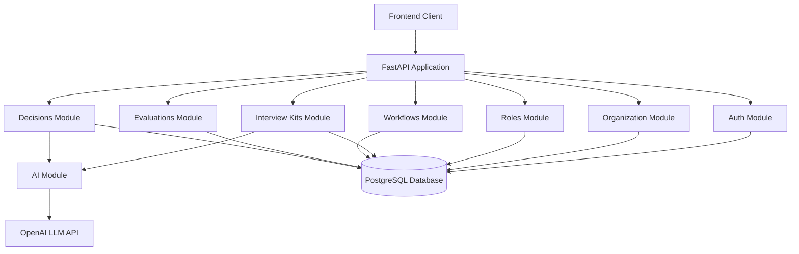

# Design Document

## Overview

The Structured Technical Interview Platform is built as a Python FastAPI backend application with a modular architecture. The system uses SQLAlchemy for database ORM, integrates with OpenAI's LLM API for content generation, and follows a layered architecture pattern with clear separation between routing, business logic, and data access.

The platform orchestrates the complete interview lifecycle: from role definition through interview kit generation, workflow execution, evaluation collection, signal aggregation, and final decision support. Each module is independently testable and follows consistent patterns for maintainability.

## Architecture

### System Architecture



### Module Structure

Each module follows a three-layer pattern:

1. **Router Layer** (`router.py`): FastAPI endpoints, request validation, response formatting
2. **Service Layer** (`service.py`): Business logic, orchestration, validation, LLM integration
3. **Repository Layer** (`repository.py`): Database operations, query construction

**LLM Integration in Business Logic:**

The AI module (`modules/ai/`) is a shared service used by business logic layers:
- **Interview Kits Service** calls AI module to generate questions
- **Decisions Service** calls AI module to generate decision briefs
- The AI module handles LLM communication, prompt construction, response parsing, and error handling
- Business logic services validate LLM outputs and persist results to database

### Technology Stack

- **Framework**: FastAPI (async Python web framework)
- **ORM**: SQLAlchemy 2.0 with async support
- **Database**: PostgreSQL
- **Authentication**: JWT tokens with bcrypt password hashing
- **LLM Integration**: OpenAI API (GPT-4)
- **Validation**: Pydantic v2 models
- **Testing**: pytest with pytest-asyncio

## Components and Interfaces

### Database Models

All models inherit from SQLAlchemy's `DeclarativeBase` and use the following base configuration:

```python
class Base(DeclarativeBase):
    pass
```

#### Organization Model

```python
class Organization(Base):
    __tablename__ = "organizations"
    
    id: Mapped[int] = mapped_column(primary_key=True)
    name: Mapped[str] = mapped_column(String(255), nullable=False)
    domain: Mapped[str] = mapped_column(String(255), nullable=False, unique=True)
    created_at: Mapped[datetime] = mapped_column(default=datetime.utcnow)
    
    # Relationships
    users: Mapped[List["User"]] = relationship(back_populates="organization")
    roles: Mapped[List["Role"]] = relationship(back_populates="organization")
    workflows: Mapped[List["Workflow"]] = relationship(back_populates="organization")
```

#### User Model

```python
class User(Base):
    __tablename__ = "users"
    
    id: Mapped[int] = mapped_column(primary_key=True)
    email: Mapped[str] = mapped_column(String(255), nullable=False, unique=True)
    hashed_password: Mapped[str] = mapped_column(String(255), nullable=False)
    full_name: Mapped[str] = mapped_column(String(255), nullable=False)
    role: Mapped[str] = mapped_column(String(50), nullable=False)  # "founder" or "interviewer"
    organization_id: Mapped[int] = mapped_column(ForeignKey("organizations.id"))
    created_at: Mapped[datetime] = mapped_column(default=datetime.utcnow)
    
    # Relationships
    organization: Mapped["Organization"] = relationship(back_populates="users")
    evaluations: Mapped[List["Evaluation"]] = relationship(back_populates="interviewer")
```

#### Role Model

```python
class Role(Base):
    __tablename__ = "roles"
    
    id: Mapped[int] = mapped_column(primary_key=True)
    title: Mapped[str] = mapped_column(String(255), nullable=False)
    description: Mapped[str] = mapped_column(Text, nullable=False)
    seniority_level: Mapped[str] = mapped_column(String(50), nullable=False)
    organization_id: Mapped[int] = mapped_column(ForeignKey("organizations.id"))
    created_at: Mapped[datetime] = mapped_column(default=datetime.utcnow)
    
    # Relationships
    organization: Mapped["Organization"] = relationship(back_populates="roles")
    competencies: Mapped[List["Competency"]] = relationship(back_populates="role", cascade="all, delete-orphan")
    interview_kits: Mapped[List["InterviewKit"]] = relationship(back_populates="role")
    workflows: Mapped[List["Workflow"]] = relationship(back_populates="role")
```

#### Competency Model

```python
class Competency(Base):
    __tablename__ = "competencies"
    
    id: Mapped[int] = mapped_column(primary_key=True)
    name: Mapped[str] = mapped_column(String(255), nullable=False)
    description: Mapped[str] = mapped_column(Text, nullable=False)
    weight: Mapped[float] = mapped_column(Float, nullable=False)
    role_id: Mapped[int] = mapped_column(ForeignKey("roles.id"))
    
    # Relationships
    role: Mapped["Role"] = relationship(back_populates="competencies")
    evaluation_scores: Mapped[List["EvaluationScore"]] = relationship(back_populates="competency")
```

#### InterviewKit Model

```python
class InterviewKit(Base):
    __tablename__ = "interview_kits"
    
    id: Mapped[int] = mapped_column(primary_key=True)
    role_id: Mapped[int] = mapped_column(ForeignKey("roles.id"))
    generated_at: Mapped[datetime] = mapped_column(default=datetime.utcnow)
    llm_model: Mapped[str] = mapped_column(String(100), nullable=False)
    
    # Relationships
    role: Mapped["Role"] = relationship(back_populates="interview_kits")
    questions: Mapped[List["InterviewQuestion"]] = relationship(back_populates="interview_kit", cascade="all, delete-orphan")
```

#### InterviewQuestion Model

```python
class InterviewQuestion(Base):
    __tablename__ = "interview_questions"
    
    id: Mapped[int] = mapped_column(primary_key=True)
    interview_kit_id: Mapped[int] = mapped_column(ForeignKey("interview_kits.id"))
    competency_id: Mapped[int] = mapped_column(ForeignKey("competencies.id"))
    question_text: Mapped[str] = mapped_column(Text, nullable=False)
    evaluation_rubric: Mapped[str] = mapped_column(Text, nullable=False)
    order: Mapped[int] = mapped_column(Integer, nullable=False)
    
    # Relationships
    interview_kit: Mapped["InterviewKit"] = relationship(back_populates="questions")
    competency: Mapped["Competency"] = relationship()
```

#### Candidate Model

```python
class Candidate(Base):
    __tablename__ = "candidates"
    
    id: Mapped[int] = mapped_column(primary_key=True)
    full_name: Mapped[str] = mapped_column(String(255), nullable=False)
    email: Mapped[str] = mapped_column(String(255), nullable=False)
    created_at: Mapped[datetime] = mapped_column(default=datetime.utcnow)
    
    # Relationships
    workflows: Mapped[List["Workflow"]] = relationship(back_populates="candidate")
```

#### Workflow Model

```python
class Workflow(Base):
    __tablename__ = "workflows"
    
    id: Mapped[int] = mapped_column(primary_key=True)
    candidate_id: Mapped[int] = mapped_column(ForeignKey("candidates.id"))
    role_id: Mapped[int] = mapped_column(ForeignKey("roles.id"))
    organization_id: Mapped[int] = mapped_column(ForeignKey("organizations.id"))
    status: Mapped[str] = mapped_column(String(50), nullable=False, default="pending")
    created_at: Mapped[datetime] = mapped_column(default=datetime.utcnow)
    completed_at: Mapped[Optional[datetime]] = mapped_column(nullable=True)
    
    # Relationships
    candidate: Mapped["Candidate"] = relationship(back_populates="workflows")
    role: Mapped["Role"] = relationship(back_populates="workflows")
    organization: Mapped["Organization"] = relationship(back_populates="workflows")
    stages: Mapped[List["WorkflowStage"]] = relationship(back_populates="workflow", cascade="all, delete-orphan")
    evaluations: Mapped[List["Evaluation"]] = relationship(back_populates="workflow")
    decision: Mapped[Optional["Decision"]] = relationship(back_populates="workflow", uselist=False)
```

#### WorkflowStage Model

```python
class WorkflowStage(Base):
    __tablename__ = "workflow_stages"
    
    id: Mapped[int] = mapped_column(primary_key=True)
    workflow_id: Mapped[int] = mapped_column(ForeignKey("workflows.id"))
    interviewer_id: Mapped[int] = mapped_column(ForeignKey("users.id"))
    stage_order: Mapped[int] = mapped_column(Integer, nullable=False)
    status: Mapped[str] = mapped_column(String(50), nullable=False, default="pending")
    
    # Relationships
    workflow: Mapped["Workflow"] = relationship(back_populates="stages")
    interviewer: Mapped["User"] = relationship()
```

#### Evaluation Model

```python
class Evaluation(Base):
    __tablename__ = "evaluations"
    
    id: Mapped[int] = mapped_column(primary_key=True)
    workflow_id: Mapped[int] = mapped_column(ForeignKey("workflows.id"))
    workflow_stage_id: Mapped[int] = mapped_column(ForeignKey("workflow_stages.id"))
    interviewer_id: Mapped[int] = mapped_column(ForeignKey("users.id"))
    notes: Mapped[str] = mapped_column(Text, nullable=False)
    submitted_at: Mapped[datetime] = mapped_column(default=datetime.utcnow)
    
    # Relationships
    workflow: Mapped["Workflow"] = relationship(back_populates="evaluations")
    workflow_stage: Mapped["WorkflowStage"] = relationship()
    interviewer: Mapped["User"] = relationship(back_populates="evaluations")
    scores: Mapped[List["EvaluationScore"]] = relationship(back_populates="evaluation", cascade="all, delete-orphan")
```

#### EvaluationScore Model

```python
class EvaluationScore(Base):
    __tablename__ = "evaluation_scores"
    
    id: Mapped[int] = mapped_column(primary_key=True)
    evaluation_id: Mapped[int] = mapped_column(ForeignKey("evaluations.id"))
    competency_id: Mapped[int] = mapped_column(ForeignKey("competencies.id"))
    score: Mapped[int] = mapped_column(Integer, nullable=False)
    
    # Relationships
    evaluation: Mapped["Evaluation"] = relationship(back_populates="scores")
    competency: Mapped["Competency"] = relationship(back_populates="evaluation_scores")
```

#### Decision Model

```python
class Decision(Base):
    __tablename__ = "decisions"
    
    id: Mapped[int] = mapped_column(primary_key=True)
    workflow_id: Mapped[int] = mapped_column(ForeignKey("workflows.id"))
    decision_maker_id: Mapped[int] = mapped_column(ForeignKey("users.id"))
    outcome: Mapped[str] = mapped_column(String(50), nullable=False)
    summary: Mapped[str] = mapped_column(Text, nullable=False)
    strengths: Mapped[str] = mapped_column(Text, nullable=False)
    concerns: Mapped[str] = mapped_column(Text, nullable=False)
    recommendation: Mapped[str] = mapped_column(Text, nullable=False)
    decided_at: Mapped[datetime] = mapped_column(default=datetime.utcnow)
    
    # Relationships
    workflow: Mapped["Workflow"] = relationship(back_populates="decision")
    decision_maker: Mapped["User"] = relationship()
```

### API Endpoints

#### Authentication Endpoints

- `POST /api/auth/register` - Register new organization and founder
- `POST /api/auth/login` - Authenticate user and return JWT token
- `POST /api/auth/invite` - Invite team member to organization

#### Organization Endpoints

- `GET /api/organizations/{org_id}` - Get organization details
- `PUT /api/organizations/{org_id}` - Update organization details

#### Role Endpoints

- `POST /api/roles` - Create new role with competencies
- `GET /api/roles/{role_id}` - Get role details with competencies
- `GET /api/roles` - List all roles for organization
- `PUT /api/roles/{role_id}` - Update role and competencies
- `DELETE /api/roles/{role_id}` - Delete role

#### Interview Kit Endpoints

- `POST /api/interview-kits/generate` - Generate interview kit for role using LLM
- `GET /api/interview-kits/{kit_id}` - Get interview kit with questions
- `GET /api/interview-kits/role/{role_id}` - List interview kits for role

#### Workflow Endpoints

- `POST /api/workflows` - Create workflow for candidate-role pairing
- `GET /api/workflows/{workflow_id}` - Get workflow details with stages
- `GET /api/workflows` - List workflows for organization
- `PUT /api/workflows/{workflow_id}/stages` - Update workflow stage assignments

#### Evaluation Endpoints

- `POST /api/evaluations` - Submit evaluation with competency scores
- `GET /api/evaluations/{evaluation_id}` - Get evaluation details
- `GET /api/evaluations/workflow/{workflow_id}` - List evaluations for workflow

#### Decision Endpoints

- `POST /api/decisions/generate-brief` - Generate decision brief using LLM
- `POST /api/decisions` - Record final hiring decision
- `GET /api/decisions/{decision_id}` - Get decision details
- `GET /api/decisions/workflow/{workflow_id}` - Get decision for workflow

#### Candidate Signal Endpoints

- `GET /api/signals/candidate/{candidate_id}/role/{role_id}` - Get aggregated signals

### AI Module Interface

The AI module is a shared service that encapsulates all LLM operations. It is called by business logic services (Interview Kits Service, Decisions Service) to generate content.

**Responsibilities:**
- Construct structured prompts with domain context
- Invoke OpenAI API with retry logic and error handling
- Parse and validate LLM JSON responses
- Return structured data to calling services

**Interface:**

```python
class AIClient:
    def __init__(self, api_key: str, model: str = "gpt-4"):
        self.api_key = api_key
        self.model = model
    
    async def generate_interview_kit(
        self, 
        role_title: str, 
        role_description: str, 
        competencies: List[Dict[str, str]]
    ) -> Dict[str, Any]:
        """
        Generate interview questions for role competencies.
        Returns: {
            "questions": [
                {
                    "competency_id": int,
                    "question_text": str,
                    "evaluation_rubric": str,
                    "order": int
                }
            ]
        }
        """
        pass
    
    async def generate_decision_brief(
        self,
        candidate_name: str,
        role_title: str,
        evaluations: List[Dict[str, Any]],
        aggregated_scores: Dict[str, float]
    ) -> Dict[str, str]:
        """
        Generate hiring decision brief from evaluations.
        Returns: {
            "summary": str,
            "strengths": str,
            "concerns": str,
            "recommendation": str
        }
        """
        pass
```

**Module Components:**
- **Client** (`client.py`): OpenAI API integration with retry logic (exponential backoff)
- **Parser** (`parser.py`): Parse LLM JSON responses into structured data
- **Validators** (`validators.py`): Validate LLM output structure and required fields

**Business Logic Flow:**
1. Service layer (e.g., Interview Kits Service) receives request
2. Service layer calls AI module with domain context
3. AI module constructs prompt, calls LLM, parses response
4. Service layer validates business rules on LLM output
5. Service layer persists results via repository layer

## Data Models

### Pydantic Schemas

Each module defines request and response schemas using Pydantic:

#### Role Schemas

```python
class CompetencyCreate(BaseModel):
    name: str
    description: str
    weight: float

class RoleCreate(BaseModel):
    title: str
    description: str
    seniority_level: str
    competencies: List[CompetencyCreate]

class CompetencyResponse(BaseModel):
    id: int
    name: str
    description: str
    weight: float

class RoleResponse(BaseModel):
    id: int
    title: str
    description: str
    seniority_level: str
    competencies: List[CompetencyResponse]
    created_at: datetime
```

#### Evaluation Schemas

```python
class EvaluationScoreCreate(BaseModel):
    competency_id: int
    score: int

class EvaluationCreate(BaseModel):
    workflow_id: int
    workflow_stage_id: int
    notes: str
    scores: List[EvaluationScoreCreate]

class EvaluationScoreResponse(BaseModel):
    competency_id: int
    competency_name: str
    score: int

class EvaluationResponse(BaseModel):
    id: int
    workflow_id: int
    interviewer_name: str
    notes: str
    scores: List[EvaluationScoreResponse]
    submitted_at: datetime
```

#### Decision Schemas

```python
class DecisionBriefResponse(BaseModel):
    summary: str
    strengths: str
    concerns: str
    recommendation: str

class DecisionCreate(BaseModel):
    workflow_id: int
    outcome: str  # "hire", "no-hire", "hold"
    summary: str
    strengths: str
    concerns: str
    recommendation: str

class DecisionResponse(BaseModel):
    id: int
    workflow_id: int
    outcome: str
    summary: str
    strengths: str
    concerns: str
    recommendation: str
    decided_at: datetime
```

### Validation Rules

- **Email**: Must match standard email regex pattern
- **Password**: Minimum 8 characters, must contain uppercase, lowercase, and number
- **Competency Weight**: Must be between 0.0 and 1.0
- **Evaluation Score**: Must be between 1 and 5 (integer)
- **Role Seniority**: Must be one of: "junior", "mid", "senior", "staff", "principal"
- **Workflow Status**: Must be one of: "pending", "in_progress", "completed"
- **Decision Outcome**: Must be one of: "hire", "no-hire", "hold"

## Correctness Properties


A property is a characteristic or behavior that should hold true across all valid executions of a system—essentially, a formal statement about what the system should do. Properties serve as the bridge between human-readable specifications and machine-verifiable correctness guarantees.

### Property 1: Organization Creation Completeness

*For any* founder registration request with valid data, creating an organization should result in a stored organization with all required fields (name, domain, timestamp) and the founder associated as an administrator with the organization.

**Validates: Requirements 1.1, 1.3**

### Property 2: Unique Identifier Generation

*For any* set of created entities (organizations, workflows, workflow stages), all generated identifiers should be unique within their entity type.

**Validates: Requirements 1.2, 5.5**

### Property 3: Invitation Round Trip

*For any* team member invitation, if an invitation is sent with a secure token, then accepting that invitation should associate the user with the correct organization as an interviewer.

**Validates: Requirements 1.4, 1.5**

### Property 4: Authentication Correctness

*For any* authentication attempt, valid credentials should result in a JWT token being issued, and invalid credentials should result in authentication rejection with an error.

**Validates: Requirements 2.1, 2.2**

### Property 5: Role-Based Access Control Enforcement

*For any* protected endpoint and any user, access should be granted if and only if the user's role has permission for that endpoint.

**Validates: Requirements 2.3**

### Property 6: Token Expiration Enforcement

*For any* expired JWT token, attempting to access protected endpoints should require re-authentication.

**Validates: Requirements 2.4**

### Property 7: Password Security

*For any* user creation or password update, the stored password should never match the plaintext password (must be hashed and salted).

**Validates: Requirements 2.5**

### Property 8: Role Data Persistence

*For any* role creation with competencies, all role fields (title, description, seniority level) and all competency fields (name, description, weight) should be retrievable after storage.

**Validates: Requirements 3.1, 3.3**

### Property 9: Role Validation

*For any* role creation attempt without competencies, the system should reject the creation with a validation error.

**Validates: Requirements 3.2**

### Property 10: Competency Weight Validation

*For any* role with multiple competencies, the sum of competency weights should be validated to ensure proper scoring calculations (weights should sum to 1.0 with reasonable tolerance).

**Validates: Requirements 3.4**

### Property 11: Historical Role Preservation

*For any* role update after workflows have been created, the original role definition should remain accessible for existing workflows while new workflows use the updated definition.

**Validates: Requirements 3.5**

### Property 12: LLM Interview Kit Generation

*For any* role with defined competencies, requesting an interview kit should invoke the LLM with role context and return questions mapped to each competency with evaluation rubrics.

**Validates: Requirements 4.1, 4.2, 4.4**

### Property 13: Interview Kit Parsing and Storage

*For any* valid LLM response for interview kit generation, parsing and storing the response should result in retrievable questions with competency associations and rubrics.

**Validates: Requirements 4.3**

### Property 14: Workflow Creation Completeness

*For any* workflow creation request, the created workflow should be associated with the correct candidate, role, and organization, have status "pending", and have unique identifiers for all stages.

**Validates: Requirements 5.1, 5.2**

### Property 15: Workflow Stage Assignment

*For any* workflow stage assignment, each stage should have at least one assigned interviewer and the stage order should be preserved.

**Validates: Requirements 5.3, 5.4**

### Property 16: Evaluation Validation and Storage

*For any* evaluation submission, all required competency scores must be provided, all scores must be within the valid range (1-5), and all evaluation data (scores, notes, timestamp, associations) should be stored correctly.

**Validates: Requirements 6.1, 6.2, 6.3, 6.4**

### Property 17: Evaluation State Transition

*For any* evaluation submission for a workflow stage, the workflow stage status should transition from "pending" to "completed".

**Validates: Requirements 6.5**

### Property 18: Signal Retrieval Completeness

*For any* candidate-role pairing with evaluations, requesting signals should retrieve all evaluations for that pairing with complete metadata (interviewer names, submission times).

**Validates: Requirements 7.1, 7.4**

### Property 19: Score Calculation Correctness

*For any* set of evaluations for a candidate-role pairing, the aggregated signals should contain correct average scores per competency and correct overall weighted scores based on competency weights.

**Validates: Requirements 7.2, 7.3**

### Property 20: Decision Brief Generation

*For any* candidate-role pairing with evaluations, requesting a decision brief should invoke the LLM with aggregated evaluation data and return a brief containing all required sections (summary, strengths, concerns, recommendation).

**Validates: Requirements 8.1, 8.2, 8.4**

### Property 21: Decision Brief Parsing and Storage

*For any* valid LLM response for decision brief generation, parsing and storing the response should result in a retrievable decision brief with all sections.

**Validates: Requirements 8.3**

### Property 22: Decision Recording Completeness

*For any* decision recording, the decision should be stored with the correct outcome, associated with the candidate, role, and decision brief, include timestamp and decision maker, and update the workflow status to "completed".

**Validates: Requirements 9.1, 9.2, 9.3, 9.4**

### Property 23: Workflow Immutability After Decision

*For any* workflow with a recorded final decision, attempts to modify the workflow should be rejected.

**Validates: Requirements 9.5**

### Property 24: Referential Integrity Enforcement

*For any* attempt to create a record with an invalid foreign key reference, the system should reject the operation with an error.

**Validates: Requirements 10.2**

### Property 25: Input Validation Before Persistence

*For any* data operation with invalid input data, the system should reject the operation before attempting database persistence.

**Validates: Requirements 10.5**

### Property 26: API Response Consistency

*For any* API endpoint response, the response should include an appropriate HTTP status code, use consistent JSON formatting, and include detailed field-level error messages when validation fails.

**Validates: Requirements 11.2, 11.3, 11.4**

### Property 27: LLM Prompt Context Inclusion

*For any* LLM invocation (interview kit or decision brief), the constructed prompt should include all relevant context (role details, competencies, or evaluation data).

**Validates: Requirements 12.2**

### Property 28: LLM Response Parsing

*For any* valid LLM response structure, parsing the response should successfully extract all required fields into structured data formats.

**Validates: Requirements 12.3**

## Error Handling

### LLM Integration Errors

- **API Failures**: Implement exponential backoff retry (3 attempts: 1s, 2s, 4s delays)
- **Malformed Responses**: Validate JSON structure and required fields, return detailed parsing errors
- **Timeout**: Set 30-second timeout for LLM API calls
- **Rate Limiting**: Handle 429 responses with appropriate backoff

### Database Errors

- **Connection Failures**: Use connection pooling with automatic reconnection
- **Transaction Failures**: Rollback all changes and return error to client
- **Constraint Violations**: Map database errors to user-friendly validation messages
- **Deadlocks**: Retry transaction up to 3 times with random jitter

### Validation Errors

- **Field-Level Errors**: Return specific field names and validation rules violated
- **Business Logic Errors**: Return clear error messages explaining why operation failed
- **Authorization Errors**: Return 403 Forbidden with minimal information to prevent information leakage

### API Error Response Format

```json
{
  "error": {
    "code": "VALIDATION_ERROR",
    "message": "Validation failed",
    "details": [
      {
        "field": "competencies",
        "message": "At least one competency is required"
      }
    ]
  }
}
```

## Testing Strategy

### Unit Testing

Unit tests will verify specific examples, edge cases, and error conditions:

- **Authentication**: Test valid/invalid credentials, token generation, password hashing
- **Validation**: Test boundary values, missing fields, invalid formats
- **Calculations**: Test score averaging and weighting with known inputs
- **State Transitions**: Test workflow and stage status updates
- **Error Handling**: Test LLM failures, database errors, validation failures
- **Edge Cases**: Test empty evaluation sets, expired tokens, malformed LLM responses

### Property-Based Testing

Property-based tests will verify universal properties across all inputs using the Hypothesis library for Python:

- **Configuration**: Minimum 100 iterations per property test
- **Test Tagging**: Each test tagged with format: `# Feature: structured-interview-platform, Property N: [property text]`
- **Generators**: Custom Hypothesis strategies for generating valid domain objects (roles, evaluations, workflows)
- **Shrinking**: Leverage Hypothesis shrinking to find minimal failing examples

**Property Test Examples**:

```python
from hypothesis import given, strategies as st
import pytest

# Feature: structured-interview-platform, Property 8: Role Data Persistence
@given(
    title=st.text(min_size=1, max_size=255),
    description=st.text(min_size=1),
    seniority=st.sampled_from(["junior", "mid", "senior", "staff", "principal"]),
    competencies=st.lists(
        st.fixed_dictionaries({
            'name': st.text(min_size=1, max_size=255),
            'description': st.text(min_size=1),
            'weight': st.floats(min_value=0.1, max_value=1.0)
        }),
        min_size=1,
        max_size=10
    )
)
async def test_role_data_persistence(title, description, seniority, competencies):
    # Normalize weights to sum to 1.0
    total_weight = sum(c['weight'] for c in competencies)
    for c in competencies:
        c['weight'] = c['weight'] / total_weight
    
    # Create role
    role_data = {
        "title": title,
        "description": description,
        "seniority_level": seniority,
        "competencies": competencies
    }
    created_role = await role_service.create_role(role_data, org_id=1)
    
    # Retrieve role
    retrieved_role = await role_service.get_role(created_role.id)
    
    # Verify all fields match
    assert retrieved_role.title == title
    assert retrieved_role.description == description
    assert retrieved_role.seniority_level == seniority
    assert len(retrieved_role.competencies) == len(competencies)
    for i, comp in enumerate(retrieved_role.competencies):
        assert comp.name == competencies[i]['name']
        assert comp.description == competencies[i]['description']
        assert abs(comp.weight - competencies[i]['weight']) < 0.001
```

### Integration Testing

Integration tests will verify end-to-end workflows:

- **Complete Interview Flow**: Create role → Generate kit → Create workflow → Submit evaluations → Generate brief → Record decision
- **Multi-User Scenarios**: Test multiple interviewers submitting evaluations
- **Concurrent Operations**: Test race conditions in workflow updates
- **Database Transactions**: Verify rollback behavior on failures

### Test Database

- Use PostgreSQL test database with same schema as production
- Reset database state between tests using transactions or fixtures
- Use factory patterns for test data generation
- Seed test database with realistic data for integration tests

### Mocking Strategy

- **LLM API**: Mock OpenAI API responses for predictable testing
- **Email Service**: Mock email sending for invitation tests
- **Time**: Mock datetime for testing time-dependent behavior
- **External Services**: Mock any external dependencies

### Coverage Goals

- **Line Coverage**: Minimum 80% for all modules
- **Branch Coverage**: Minimum 70% for business logic
- **Property Coverage**: All 28 properties must have corresponding property tests
- **Critical Paths**: 100% coverage for authentication, authorization, and data persistence
